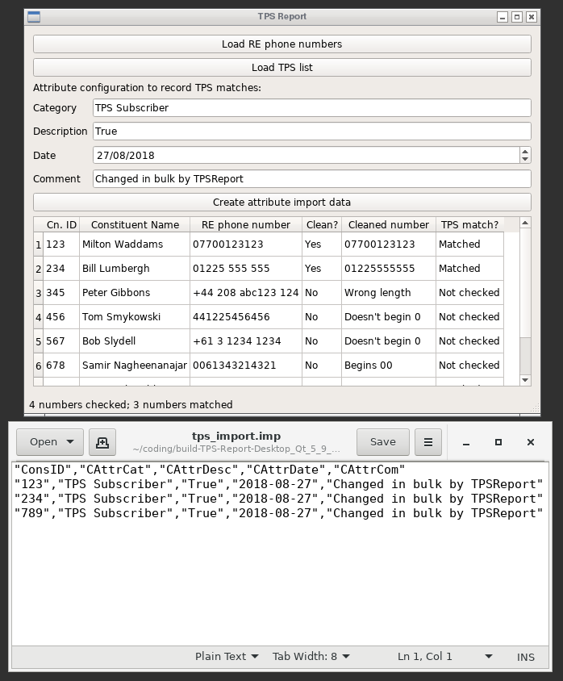

# TPS-Report

This is a simple one-page application to assist administrators of Blackbaud's The Raiser's Edge fundraising CRM system to comply with Ofcom's Telephone Preference Service.

It compares a .csv export of the phone numbers in Raiser's Edge with the TPS list (not included), and creates a .csv file to record a new Attribute on every constituent record with a matching phone number. You can choose what that attribute should look like, although sensible defaults are provided.

Usage
-----

1. Decide on the name and type of the Constituent Attribute you'll use to identify TPS subscribers - for instance, a Yes/No attribute named "TPS Subscriber". Create an attribute of that type in RE. ("Allow Only 1 per Record" should probably be ticked.)
2. Create a .csv file containing the Constituent ID, Constituent Name, and phone number for all the constituents in RE you'd like to check against the TPS list (for instance, make a Query which selects Phone Type is one of Home, Work, Mobile etc and export from that.)
3. Click the "Load RE phone numbers" button and load that .csv file. You should see the data appear in the correct columns in the lower half of the window, along with TPS Report's attempt to put them into a consistent 'clean' format to compare with the TPS list.
4. Click the "Load TPS list" button and select the file you'll have purchased from Ofcom. (It expects a text file, so you might need to unzip it first.) This step will take a while; it updates the status bar as the file is loaded.
5. Whenever both files are loaded, it will immediately check each RE phone number against the TPS list (again providing updates on the status bar). The "TPS Match?" column will change from "Not Checked" to "No Match" and "Matched".
6. Click "Create attribute import data", and save the import data as a new file.
7. In RE, Import a Constituent Attribute using this file.
8. (To do: create a cover sheet of some kind)

Notes and caveats
-----------------

This application has not been tested. It has been written against the TPS specification at https://corporate.tpsonline.org.uk/index.php/tps/technical and against my own recollection as an experience Raiser's Edge administrator. The worst that can happen is you could import a load of incorrect attributes; nonetheless, use at your own risk.

There are four versions of the TPS list available: the "full" list, and the "changes since" list, both with and without spaces. This application presently will accept only the "full" list, with or without spaces. For subsequent uploads when Ofcom update the list, either filter out already-flagged constituents from the phone number query, or remove the attribute from all your constituents before reapplying, or enjoy a lot of exceptions in the Import if you set the Attribute to "only one per record".

As the phone numbers in RE are unlikely to match the format of those in the TPS list, these steps are taken, in this order, to make them comparable to the TPS format:

 - remove (0), so +44(0)1225 421421 becomes +441225 421421
 - remove spaces and hyphens
 - replace initial +44 with 0
 - remove remaining non-numeric characters
 - discard numbers starting with 00
 - discard numbers not starting with 0
 - discard numbers with more or less than 11 digits

 The discarded numbers are assumed to be non-UK or misformed numbers and are excluded from the check.

It would probably be useful to filter/sort/extract the processed phone numbers at this point for analysis, error checking etc. This can be done after an hour or so of tinkering.

This project has been a learning exercise in quickly making a simple, practical bespoke business tool. Feedback is greatly appreciated - it is very simple to make changes to an application of this nature.

